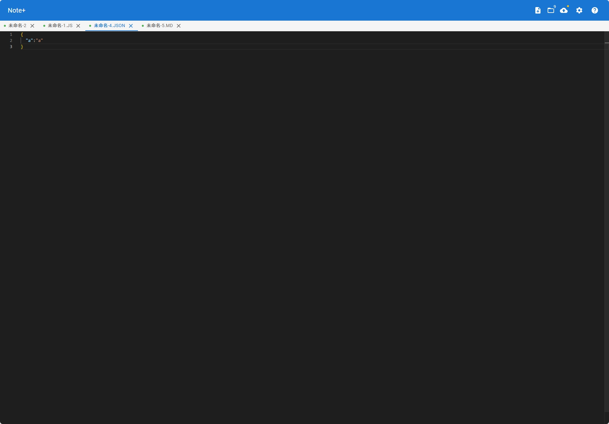

# Note+ | Cloud Notes+

English | [简体中文](./README.md)

## 📝 Project Introduction

Note+ is a modern cloud-based note-taking application built with React + TypeScript + Vite, offering powerful editing capabilities and cloud synchronization.

Online Demo: [http://note.aexp.top/](http://note.aexp.top/)



## ✨ Features

- 🎯 Professional editor based on Monaco Editor
- 🔄 Gitee cloud synchronization
- 📁 Local storage for data security
- 🎨 Syntax highlighting for multiple programming languages
- 📱 Responsive design for multi-platform usage
- ⚡️ Fast startup and editing experience
- 🔍 File search functionality
- 🎉 Auto-save feature

## 🚀 Quick Start

### Requirements

- Node.js >= 16
- npm or yarn

### Installation

```bash
# Clone the project
git clone https://github.com/llongtao/note-plus.git

# Enter project directory
cd note-plus

# Install dependencies
yarn install

# Start development server
yarn dev
```

### Build

```bash
# Build for production
yarn build
```

## 🛠 Tech Stack

- React 19
- TypeScript
- Vite 6
- Monaco Editor
- Material-UI
- Axios

## 📖 Usage Guide

1. **Create Note**: Click the "New File" button in the toolbar
2. **Edit Note**: Write content directly in the editor
3. **Save Note**: Auto-save or click the save button manually
4. **Cloud Sync**:
   - Configure Gitee repository information
   - Click sync button to upload/download notes

## 🤝 Contributing

Issues and Pull Requests are welcome to help improve the project.

## 📄 License

This project is licensed under the [MIT](LICENSE) License.

## 🙏 Acknowledgments

- [Monaco Editor](https://github.com/microsoft/monaco-editor)
- [Material-UI](https://mui.com/)
- [Vite](https://vitejs.dev/)
